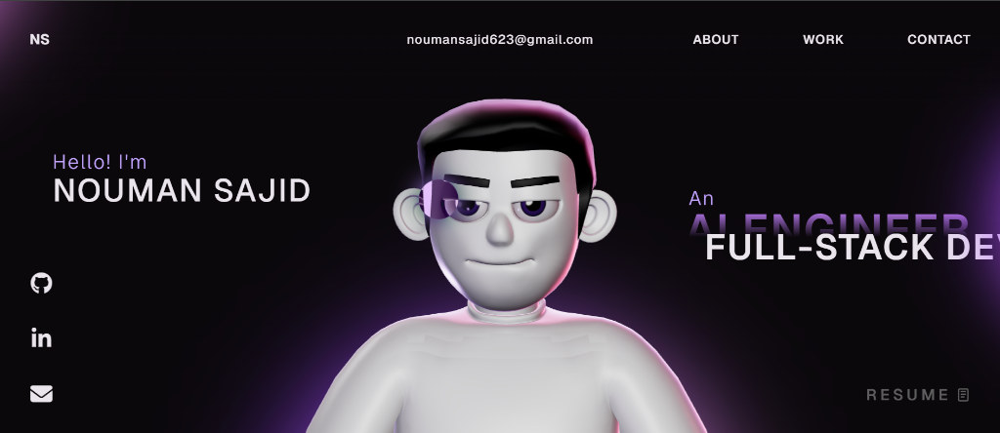
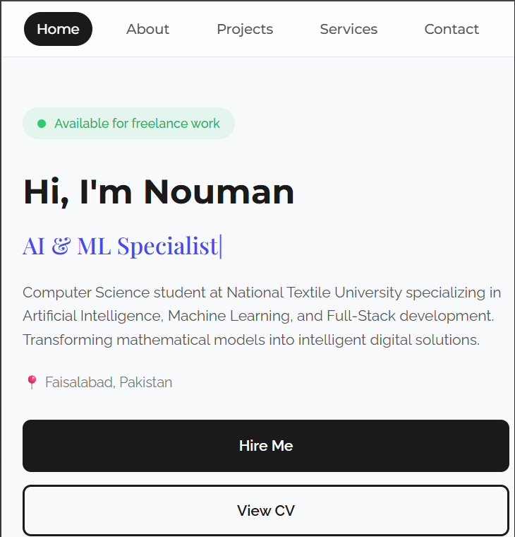

# 🚀 3D Developer Portfolio Website (React + TypeScript + Three.js)

A modern, interactive **developer portfolio website** built with **React**, **TypeScript**, **Three.js**, **GSAP**, and **WebGL**.

---

## 📸 Screen Shots

### Desktop View


### Mobile View (Loader & Navigation)


---

## 👨‍💻 Developer Profile

- **Name:** Nouman Sajid
- **Title:** AI & ML Specialist | Full-Stack Developer
- **Education:** Computer Science Student at National Textile University
- **Focus:** Artificial Intelligence, Machine Learning & Modern Web Applications

---

## ✨ Highlights

- **3D / WebGL experience** powered by **Three.js** & **React Three Fiber**
- Smooth animations & scroll triggers with **GSAP**
- Modern, clean, and responsive **React + TypeScript** codebase
- Fast performance & interactive UI built for desktop and mobile

---

## 🌟 Featured Projects

- **Auto-Apply AI:** An autonomous multi-agent AI workspace that automates job hunting with native PDF parsing, ATS scoring, multi-engine job scraping, Playwright form-filling, and automated Gmail OAuth2 dispatch.
- **Vet Management System:** Practice portal for veterinary clinics to schedule client appointments, update animal clinical files, record vaccines, and generate billing reports.
- **Diabetes Prediction:** Predictive model leveraging patient health metrics for medical workspaces.
- **AI Maze Solver:** Intelligent algorithm visualizing pathfinding with illuminated coordinate paths.

---

## 🧰 Tech Stack

- **Frontend:** React, TypeScript, Vite, HTML5, CSS3, Tailwind CSS
- **3D & Animation:** Three.js, React Three Fiber, GSAP
- **AI & ML / Backend:** Python, Scikit-learn, Flask, Next.js, FastAPI
- **Database & Tools:** SQL, PostgreSQL, Playwright, Git & GitHub, Figma

---

## 🚀 Getting Started

### 1) Clone

```bash
git clone https://github.com/alfa546/Nouman-sajid-portfolio.git
cd Nouman-sajid-portfolio
```

### 2) Install Dependencies

```bash
npm install
```

### 3) Run Locally

```bash
npm run dev
```

### 4) Build for Production

```bash
npm run build
```

---

## 🤝 Connect & Socials

- **GitHub:** [alfa546](https://github.com/alfa546)
- **LinkedIn:** [Nouman Sajid](https://www.linkedin.com/in/muhammad-nouman-sajid-92343842b)
- **Email:** noumansajid623@gmail.com

---

## 🪪 License

This project is open source and available under the **MIT License**.
